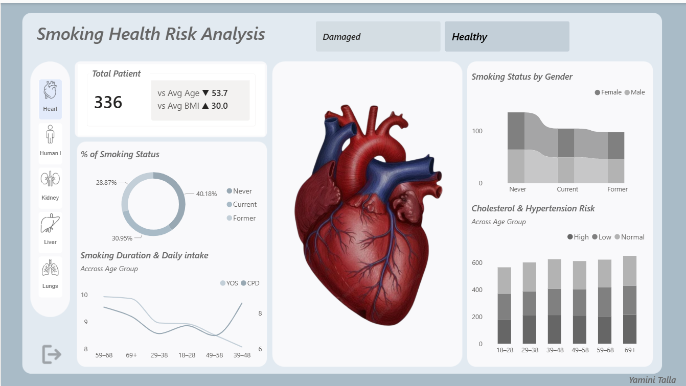

# 📊 Smoking Human Risk Analysis Dashboard

## 📌 Overview
This project presents an interactive dashboard built using Microsoft Power BI to analyze the impact of smoking on human health.
It helps visualize patterns, trends, and risk factors across different demographics.

## 🔍 Key Insights
- Distribution of smoking status (Never, Current, Former)
- Gender-wise comparison of smoking habits
- Impact of cholesterol and hypertension across age groups
- Relationship between smoking duration and daily cigarette intake

## ✨ Features
- Interactive slicers (Healthy vs Damaged conditions)
- Dynamic and responsive visualizations
- Clean, user-friendly dashboard design

## 🛠️ Tools Used
- Microsoft Power BI

## 📁 Files Included
- Human Health Risk Analysis.pbix – Power BI dashboard file
- health_dataset.csv – Main dataset
- condition.csv – Health condition data
- Organs.csv – Organ-related reference data
- dashboard.png – Dashboard screenshot
- demos/dashboard-demo.gif – Demo file

## 📸 Dashboard Preview

## 🎬 Demo
https://github.com/user-attachments/assets/bb4c6a47-795f-4f57-a63d-eea8d3913bb4

## 🚀 Highlights
- Developed an interactive and insightful dashboard
- Performed data analysis on health-related datasets
- Improved data visualization and storytelling skills using Power BI

